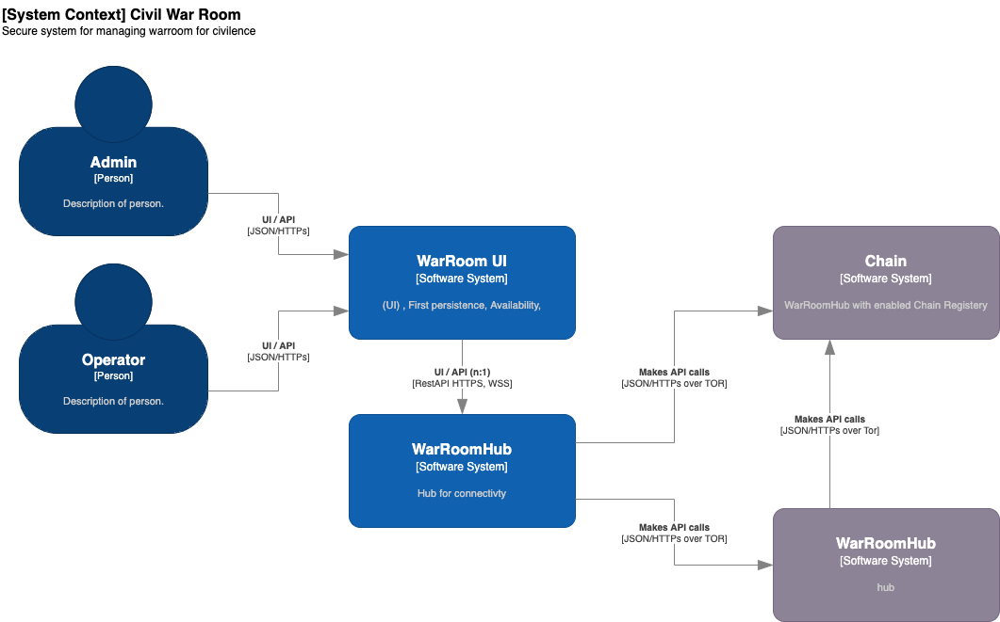

# CivilWarRoom
A system that supports a state of war for civilian needs. Because of a war situation in Israel, the people of Israel unite and open war rooms to help each other in a war situation.

## Imporant Links
* Project board: https://github.com/users/alefbt/projects/1/views/1
* Wiki: https://github.com/alefbt/CivilWarRoom/wiki

# Quick start

## Running in Development mode
See 

## Build docker
Requirements:
* node.js  > 20.0.0
* yarn > 1.22
* docker > 20

Building:
```bash
cd ./scripts/
./build-production-package.sh
```

Running docker: 
```bash
docker run -p 8080:8080  alefbt.com/warroom
```

# Architecture
See more about the architecture [here](./docs/architecture/README.md)



## War Room UI
Responsible for user interface and interaction via WebSocket to WarRoom Hub

* Code folder found `./civilWarRoomUI` see [here](./civilWarRoomUI/README.md)
* Base on [Quasar framework](https://quasar.dev/)

Note: UI Backend is proxy for WarRoomHub

### Requirements
* Nodejs , npm/yarn

### UI Context Diagram


## War Room Hub
Responsible for be repository for data
and also serves the UI

Build on EventSource and CQRS concept (isolatioion between Query and Execution of envents)

### Requirements
* MongoDB >= mongodb-community-server:7.0.0-ubi8
* RabbitMQ >= 3
* Redis
* Nodejs , npm/yarn

### Hub Context Diagram


## Process Description
### Authentication
UI means only on the browser of the user e.g. FrontEnd


# Development
Working with GitFlow methodolgy, it means that you open a branch for each task you want to develop e.g. `feature/<name>` and commit the changes and push after that we will do pull request and marge to development branch.


## Requiremnts
* Node.js
* Yarn (or NPM)
* Docker
* Docker-compose
* Python

## Spinup
1. Run development enviroment dockers this will spinup Mongo,RabbitMQ, Redis
```bash
cd ./dockers/civil-war-room-dev-env-1
docker-compose up 
```

2. Run HubWorker
```bash
cd ./civilWarRoomHubWorker/
python src/server.py
```

3. Run Hub
```bash
cd ./civilWarRoomHub/
yarn run dev
```

4. Run UI
```bash
cd ./civilWarRoomUI/
yarn run dev
```

# License
* GPLv3 license
* All rights reserved to Yehuda Korotkin